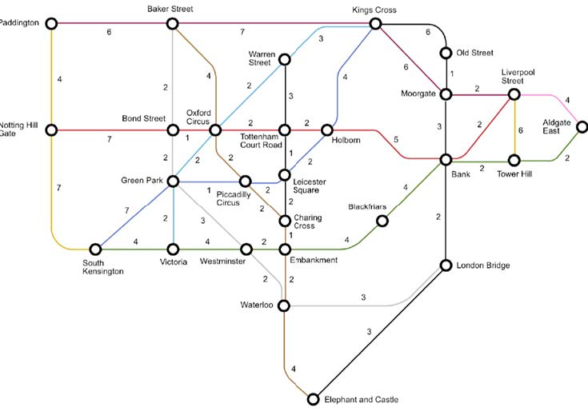

# Briefing
    Initialization: map data(stations and distance);
    Input: the place of departure and destination;
    Output: route of the fastest path and time comsumption.
    User Interface: correct spelling required; mispellation is not having search suggestion.
This python file implements dijkstra algorithm onto the routing problem based on following map.

 
# Evironment
Python 3.9
 
# Comments
    
    Due to reliance on greedy alculation, this algorithm is not suitable for network of large scale;
    Stopping station is not supported;
    Also requires static network, non-negative weights and additional storage during the calculation.
Try Floyd-Warshall Algorithm or A* Search Algorithm next time.